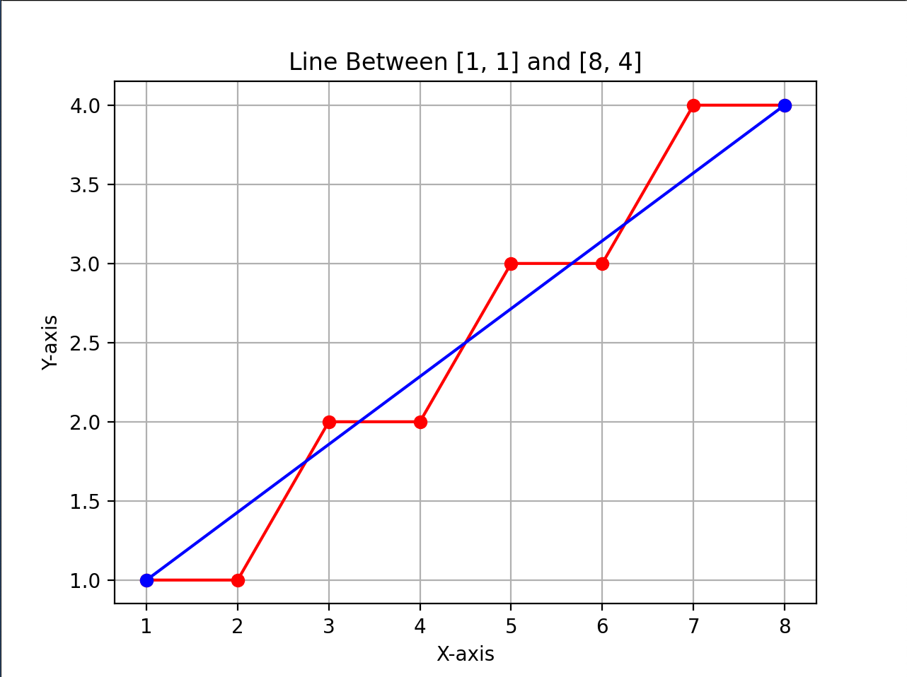

### Necessary Adjustments for m > 1 in Bresenham's Line Drawing Algorithm

 **1. Y-Axis Iteration:**

  - Instead of traversing the x-axis, the algorithm progresses along the y-axis..
  - Each step maintains a consistent change in the y-coordinate, simplifying computations.

 **2. Role Reversal of X and Y:**

  - The roles of x and y are interchanged, altering the direction of traversal.
  - Pixel selection and parameter computations prioritize adjustments in the y-coordinate.

 **3. Decision Parameter Adjustment::**
  - The decision parameter (D) is recalculated based on changes in the y-coordinate.
  - Ensures precise determination of pixel selection along the line's trajectory.

- **Case 1**: Line from (1,1) to (8,4) - Represents a slope where 0 < m < 1.

- **Case 2**: Line from (1,1) to (4,8) - Represents a slope where m > 1.

